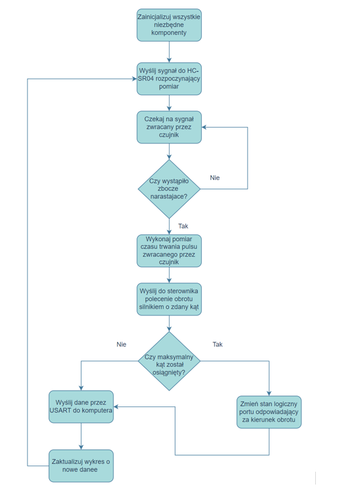

# Sonar Project with Ultrasonic Sensor

## Project Report

### Subject: Embedded Applications Sensors
### Course: Electronics and Telecommunications - Embedded Systems, 1st Year of Master's Studies

### Authors:
- W P
- H S
- J R

### Date: 14th June 2024

## Table of Contents
1. [Project Description and Objectives](#project-description-and-objectives)

   1.1. [Project Goal](#project-goal)

   1.2. [Application](#application)

   1.3. [Project Assumptions](#project-assumptions)

2. [Construction of the Microprocessor System](#construction-of-the-microprocessor-system)

   2.1. [System Block Diagram](#system-block-diagram)

   2.2. [STM32 Microcontroller](#stm32-microcontroller)

   2.3. [HC-SR04 Distance Sensor](#hc-sr04-distance-sensor)

   2.4. [TMC2226 Motor Driver](#tmc2226-motor-driver)

   2.5. [Other Components](#other-components)

   2.6. [System Connection Scheme](#system-connection-scheme)

3. [Project Description](#project-description)

   3.1. [Simplified Operation Description](#simplified-operation-description)

   3.2. [Project Structure](#project-structure)

   3.3. [Used Libraries](#used-libraries)

   3.4. [Project Diagram](#project-diagram)

4. [Project Implementation](#project-implementation)

   4.1. [Step-by-step Implementation](#step-by-step-implementation)

   4.2. [Functioning of the Completed Project](#functioning-of-the-completed-project)

   4.3. [Encountered Issues](#encountered-issues)

5. [Summary](#summary)
6. [References](#references)

---

## Project Description and Objectives

### Project Goal
The aim of the project is to create a microprocessor system resembling professional sonars, utilizing ultrasonic waves to detect objects in its path. In addition to real-time distance measurement using an ultrasonic sensor, the system will visualize detected objects on a connected computer.

### Application
Ultrasonic sensors are widely used in applications such as automotive parking sensors, robotic vacuums for obstacle detection, wall sensors, and mapping of indoor spaces. This project aims to enhance these capabilities by providing a wider detection angle, thereby potentially uncovering new applications.

### Project Assumptions
The project integrates components around the STM32 microcontroller on the NUCLEO-L476RG development board. It connects the HC-SR04 ultrasonic distance module with a TMC2226 stepper motor driver and communicates distance measurements and angle data to a computer via USART for graphical representation.

## Construction of the Microprocessor System

### System Block Diagram

The system's components are interconnected as illustrated in the block diagram below. The STM32 microcontroller serves as the central unit connecting all subsystems, managing communication with the HC-SR04 distance sensor, sending commands to the TMC2226 stepper motor driver, and transmitting measurement data to the computer.

### STM32 Microcontroller

The STM32 microcontroller (STM32L476RG on NUCLEO-L476RG board) was selected for its low power consumption and high performance characteristics. It features an ARM Cortex-M4 core with FPU, operating at up to 80 MHz, and includes 1 MB Flash memory, 128 KB SRAM, various communication interfaces (USB, UART, SPI, I2C), and peripherals such as ADC, DAC, comparators, and timers.

### HC-SR04 Distance Sensor

The HC-SR04 ultrasonic distance sensor measures distances from 2 to 200 cm using ultrasonic pulses. It operates at 5V and interfaces with the STM32 microcontroller via Trigger and Echo pins.

### TMC2226 Motor Driver

The TMC2226 stepper motor driver provides precise control over the stepper motor, facilitating accurate angular adjustments in applications such as 3D printers and CNC machines.

### Other Components

Additional components include a salvaged stepper motor, a Windows computer for graphical representation (using Python), and a power bank for powering the stepper motor.

### System Connection Scheme

The components are interconnected as shown in the following diagram, highlighting the connections between the STM32 microcontroller, HC-SR04 sensor, TMC2226 driver, and the computer via USART.

---

## Project Description

### Simplified Operation Description

The microcontroller triggers the HC-SR04 sensor to emit ultrasonic pulses and measures the time taken for the pulses to return (Echo signal). Based on the measured time, it calculates the distance to an object. After each distance measurement, the microcontroller commands the TMC2226 driver to rotate the stepper motor by a set angle. Distance and angle data are transmitted via USART to a computer, where a Python program visualizes detected objects.

### Project Structure

The project repository includes the following main folders:

- `graphics`: Python code for graphical representation of sonar data
- `src`: Libraries, source code, and project logic
- `documentation`: Project documentation

### Used Libraries

#### C Programming Language (STM32 Microcontroller)
- `gpio`: GPIO configuration and control
- `HC-SR04`: Custom library for HC-SR04 sensor
- `Stepper`: Custom library for TMC2226 driver
- `stm32l4xx_hal_msp`: Initialization functions for STM32L476 hardware
- `stm32l4xx_it`: Interrupt handling for STM32L476
- `syscalls`, `sysmem`: System-level functions for embedded systems
- `tim`, `usart`: Timer and USART configuration and management

#### Python Programming Language
- `numpy`: Numerical computations and array operations
- `serial`: Serial communication library
- `matplotlib`: Plotting and data visualization

### Project Diagram

---

## Project Implementation

### Step-by-step Implementation

1. **HC-SR04 Sensor Configuration**: Configure timer to generate 10us trigger pulses and measure Echo signal duration for distance calculation.
2. **TMC2226 Motor Driver Setup**: Configure driver to rotate stepper motor by 5° after each distance measurement.
3. **Python Program Development**: Develop Python program to receive distance and angle data via USART and visualize it using matplotlib.

### Functioning of the Completed Project

The completed project successfully scans its surroundings, detects objects within the specified angle, and plots them on a graph. The accuracy of distance measurements and angle adjustments is adequate given the project's constraints.

### Encountered Issues

Several challenges were encountered during project implementation, including cable management around the HC-SR04 sensor hindering motor rotation, resolved through physical adjustments and testing.

---

## Summary

The Sonar project with Ultrasonic Sensor demonstrates the integration of STM32 microcontroller, HC-SR04 sensor, and TMC2226 motor driver to create a functional sonar system. It offers potential applications in various fields requiring object detection and visualization.

---

## References

- STM32L476RG Datasheet
- HC-SR04 Sensor Documentation
- TMC2226 Driver Specifications
- Python Documentation for matplotlib
